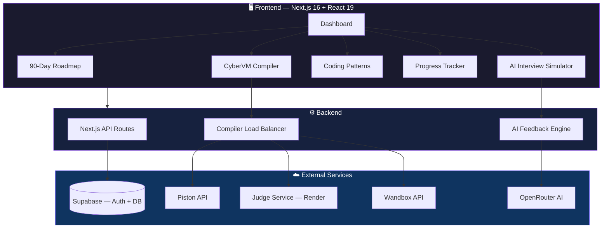

<div align="center">

<!-- Animated SVG Header -->


<!-- Typing Animation -->
<a href="https://java-dsa-in-3-months.vercel.app">
  
</a>

<br/>

<!-- Badges Row 1 -->
[](https://java-dsa-in-3-months.vercel.app)
[](https://nextjs.org)
[](https://www.typescriptlang.org)
[](https://react.dev)

<!-- Badges Row 2 -->
[](https://supabase.com)
[](https://vercel.com)
[](LICENSE)

<br/>

<!-- Star & Fork Badges -->
<a href="https://github.com/tellapallyakhil/JAVA-DSA-IN-3-MONTHS-/stargazers"></a>
<a href="https://github.com/tellapallyakhil/JAVA-DSA-IN-3-MONTHS-/network/members"></a>
<a href="https://github.com/tellapallyakhil/JAVA-DSA-IN-3-MONTHS-/issues"></a>

</div>

<br/>

<!-- Animated Divider -->


## ⚡ What is DSAPrep?

> **DSAPrep** is a **full-stack, AI-powered platform** that transforms how students prepare for technical interviews. It combines a **structured 90-day roadmap**, **built-in Java compiler**, **AI mock interviews**, and **spaced repetition** — all in one beautiful, dark-themed interface.

<br/>

<div align="center">
<table>
<tr>
<td align="center" width="250">

<br/><b>90-Day Roadmap</b>
<br/><sub>Day-by-day structured plan covering Arrays → Graphs → DP</sub>
</td>
<td align="center" width="250">

<br/><b>CyberVM Compiler</b>
<br/><sub>Run Java code instantly with 3-engine fallback system</sub>
</td>
<td align="center" width="250">

<br/><b>AI Interviews</b>
<br/><sub>Practice with AI-powered mock technical interviews</sub>
</td>
</tr>
<tr>
<td align="center" width="250">

<br/><b>14 Coding Patterns</b>
<br/><sub>Master Sliding Window, Two Pointers, BFS/DFS & more</sub>
</td>
<td align="center" width="250">

<br/><b>Progress Tracking</b>
<br/><sub>Study heatmap, streaks, calendar & completion stats</sub>
</td>
<td align="center" width="250">

<br/><b>Spaced Repetition</b>
<br/><sub>Smart revision reminders to retain what you learn</sub>
</td>
</tr>
</table>
</div>

<br/>


## 🏗️ Architecture



<br/>


## 🚀 Features Deep Dive

### 📅 90-Day Structured Roadmap
| Phase | Days | Topics | Difficulty |
|:---:|:---:|---|:---:|
| 🟢 | 1–30 | Arrays, Strings, Linked Lists, Stacks, Queues | Foundation |
| 🟡 | 31–60 | Trees, Graphs, Heaps, Sorting, Searching | Intermediate |
| 🔴 | 61–90 | Dynamic Programming, Backtracking, Greedy, Tries | Advanced |

> Each day includes: **Concept → Video → Practice Problems → Quiz → Flashcards**

---

### 💻 CyberVM — Online Java Compiler

The built-in compiler features a **3-engine fallback system** with automatic failover and circuit breaker pattern:

```
┌─────────────────────────────────────────────────────┐
│                   CYBERVM ENGINE                     │
├──────────────┬──────────────┬────────────────────────┤
│  🥇 Piston   │  🥈 Judge    │  🥉 Wandbox            │
│  (Primary)   │  (Render)    │  (Fallback)            │
│  Always-on   │  Self-hosted │  OpenJDK 22            │
├──────────────┴──────────────┴────────────────────────┤
│  ⚡ In-Memory LRU Cache (200 entries, 1hr TTL)       │
│  🔄 Circuit Breaker (auto-skip broken engines)       │
│  🛡️ Rate Limiting (20 req/min per IP)                │
│  📊 Real-time Complexity Analysis (Time + Space)     │
└─────────────────────────────────────────────────────┘
```

**Compiler Features:**
- ⚡ **Auto-Indentation** — Smart Enter/Tab with brace matching
- 🔍 **Live Complexity Analysis** — O(n), O(log n), O(n²) detection in real-time
- 🧩 **Pattern Detection** — Identifies Binary Search, Sliding Window, etc.
- 🔐 **Security Sandbox** — Blocks dangerous code patterns (reflection, file I/O, etc.)

> **💡 Pro Tip:** Use `CTRL + ENTER` to quickly execute your code in CyberVM.


---

### 🤖 AI Interview Simulator
- Practice DSA problems with an **AI interviewer**
- Get real-time **hints**, **feedback**, and **code review**
- Powered by **LangChain + OpenRouter**
- Company-specific interview prep (Google, Amazon, Microsoft, etc.)

---

### 🎯 14 Coding Patterns

<div align="center">

| # | Pattern | Key Problems |
|:---:|---|---|
| 1 | 🪟 Sliding Window | Max Subarray, Longest Substring |
| 2 | 👆 Two Pointers | Container With Most Water, 3Sum |
| 3 | 🐢 Fast & Slow Pointers | Linked List Cycle, Happy Number |
| 4 | 📊 Merge Intervals | Insert Interval, Meeting Rooms |
| 5 | 🔄 Cyclic Sort | Missing Number, Find Duplicate |
| 6 | 🔗 In-place Linked List Reversal | Reverse Linked List, Swap Pairs |
| 7 | 🌳 Tree BFS | Level Order, Zigzag Traversal |
| 8 | 🌲 Tree DFS | Path Sum, Max Depth |
| 9 | 🏔️ Two Heaps | Find Median, Sliding Window Median |
| 10 | 📋 Subsets | Permutations, Combinations |
| 11 | 🔍 Modified Binary Search | Search Rotated Array |
| 12 | 🏆 Top K Elements | K Largest, K Frequent |
| 13 | 🔀 K-way Merge | Merge K Sorted Lists |
| 14 | 🧮 Dynamic Programming | Climbing Stairs, Coin Change |

</div>

---

### 📊 Progress Dashboard Features
- 🔥 **Study Heatmap** — GitHub-style contribution graph
- 📅 **Calendar View** — Track daily study sessions
- 🏆 **Dream Company Widget** — Set target companies & track progress
- ⏱️ **Pomodoro Timer** — Built-in study timer
- 📝 **Short Notes** — Quick reference notes per topic
- 🃏 **Flashcard Deck** — Spaced repetition flashcards
- 🔔 **Revision Reminders** — Smart recall notifications

<br/>


## 🛠️ Tech Stack

<div align="center">

| Layer | Technology |
|:---:|---|
| **Framework** |   |
| **Language** |    |
| **Styling** |   |
| **Auth & DB** |   |
| **AI** |   |
| **Compiler** |   |
| **Hosting** |   |

</div>

<br/>


## ⚡ Quick Start

### Prerequisites
- **Node.js** 18+ 
- **npm** or **yarn**
- Supabase account (for auth)

### Installation

```bash
# 1. Clone the repository
git clone https://github.com/tellapallyakhil/JAVA-DSA-IN-3-MONTHS-.git

# 2. Navigate to the project
cd JAVA-DSA-IN-3-MONTHS-

# 3. Install dependencies
npm install

# 4. Set up environment variables
cp .env.example .env.local
# Edit .env.local with your Supabase keys

# 5. Start the development server
npm run dev
```

### Environment Variables

```env
NEXT_PUBLIC_SUPABASE_URL=your_supabase_url
NEXT_PUBLIC_SUPABASE_ANON_KEY=your_supabase_anon_key
OPENROUTER_API_KEY=your_openrouter_key
JUDGE_SERVICE_URL=your_judge_service_url
```

### Judge Service (Compiler Backend)

```bash
# Deploy the Java compiler service
cd judge-service
docker build -t dsa-judge .
docker run -p 8000:8000 dsa-judge
```

<br/>


## 📁 Project Structure

```
📦 JAVA-DSA-IN-3-MONTHS-
├── 📂 src/
│   ├── 📂 app/                    # Next.js App Router pages
│   │   ├── 📂 api/                # API routes
│   │   │   ├── 📂 execute/        # Java compiler endpoint
│   │   │   └── 📂 interview/      # AI interview endpoint
│   │   ├── 📂 compiler/           # CyberVM Compiler page
│   │   ├── 📂 topics/             # DSA Topics page
│   │   ├── 📂 patterns/           # 14 Coding Patterns
│   │   ├── 📂 companies/          # Dream Companies
│   │   ├── 📂 focus/              # Topic Focus Mode
│   │   ├── 📂 interview/          # AI Mock Interview
│   │   ├── 📂 profile/            # User Dashboard
│   │   └── 📂 progress/           # Progress Tracker
│   ├── 📂 components/             # React components (21 files)
│   │   ├── CompilerContainer.tsx   # CyberVM with 3-engine fallback
│   │   ├── InterviewSimulator.tsx  # AI Interview (61KB of logic!)
│   │   ├── PatternsContainer.tsx   # 14 Pattern visualizations
│   │   ├── StudyHeatmap.tsx        # GitHub-style contribution graph
│   │   ├── DreamCompanyWidget.tsx  # Company-specific prep
│   │   ├── PomodoroTimer.tsx       # Study timer
│   │   ├── FlashcardDeck.tsx       # Spaced repetition cards
│   │   └── ...more
│   ├── 📂 data/                   # DSA content & problem data
│   ├── 📂 hooks/                  # Custom React hooks
│   ├── 📂 lib/                    # Utility functions
│   └── 📂 context/                # React context providers
├── 📂 judge-service/              # Self-hosted Java compiler
│   ├── main.py                    # FastAPI server
│   ├── executor.py                # Sandboxed Java executor
│   └── Dockerfile                 # Container config
└── 📂 public/                     # Static assets
```

<br/>


## 🤝 Contributing

Contributions are welcome! Here's how you can help:

1. **Fork** the project
2. **Create** your feature branch (`git checkout -b feat/amazing-feature`)
3. **Commit** your changes (`git commit -m 'feat: add amazing feature'`)
4. **Push** to the branch (`git push origin feat/amazing-feature`)
5. **Open** a Pull Request

<br/>

## 📬 Contact

<div align="center">

[](mailto:tellapallyakhil89@gmail.com)
[](https://www.linkedin.com/in/tellapalli-akhil-kumar-188a0028a)
[](https://github.com/tellapallyakhil)

</div>

<br/>

<!-- Animated Footer -->


<div align="center">
  <sub>Built with ❤️ by <a href="https://github.com/tellapallyakhil">Tellapalli Akhil Kumar</a></sub>
  <br/>
  <sub>⭐ Star this repo if it helped you!</sub>
</div>
